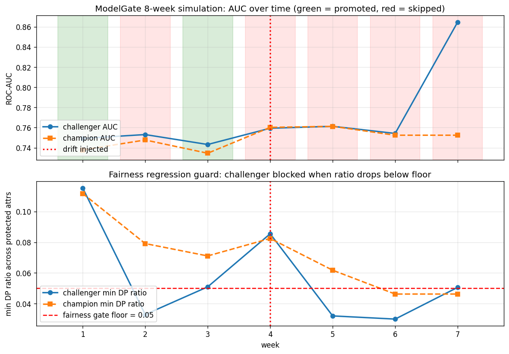

# ModelGate

Automated ML retraining with champion / challenger promotion, a fairness
regression gate, and one-command rollback. Built around the MLflow Model
Registry's Aliases API.

[](https://www.python.org/downloads/)
[](LICENSE)

## Why

Most "I trained a model" projects stop the moment the joblib hits disk.
The interesting questions start there: when fresh data arrives, do you
retrain? Does the new model actually beat the old one on the metrics
that matter — including fairness? If it does, how do you swap it in
atomically? If it later misbehaves, how do you roll back?

ModelGate ships the whole loop end-to-end on the Home Credit Default
Risk dataset: a scheduled retrain, a promotion gate that evaluates AUC,
PR-AUC, Brier, fairness DP / EO ratios, and drift PSI before swapping
the `@champion` alias, an append-only JSONL audit log of every
decision, and a `rollback --dry-run` CLI that pins any past version.

## Headline result — 8-week production simulation

Sort the 307k Home Credit applications by id, carve into 8 weeks,
inject a 10% income shift from week 4 onward, retrain every week. The
gate decides:

| Week | Decision | Why |
|---|---|---|
| 0 | bootstrap | initial champion v1 |
| 1 | **PROMOTE** v2 | all gates passed (AUC 0.7493 vs 0.7379) |
| 2 | skip v3 | fairness regressed: min DP ratio 0.079 → 0.033 |
| 3 | **PROMOTE** v4 | stable improvement |
| 4 | skip v5 | drift injection detected (PSI 2.65 > 2.0) |
| 5 | skip v6 | fairness + drift both fail |
| 6 | skip v7 | fairness + drift both fail |
| 7 | skip v8 | drift PSI 12.4 — even with AUC 0.865, fairness floor blocks |

The last row is the most interesting. **Week 7's challenger has AUC
0.865 — much higher than the champion's 0.752 — and the gate still
rejects it**, because the underlying training distribution has drifted
beyond what the gate tolerates and the DP-ratio is at the floor. Higher
accuracy does not override safety.



## Architecture

```
GitHub Actions cron (weekly)
        |
        v
modelgate.retrain --week N
        |
        +-- pull rolling 4-week window
        +-- train challenger -> MLflow run -> register -> alias @challenger
        +-- evaluate on next week (holdout): AUC, PR-AUC, Brier, fairness, drift
        +-- gate.decide() -> PromotionDecision
        +-- if promote:
        |       set_registered_model_alias("credit_risk", "champion", new_version)
        |       drop the @challenger alias
        |   else:
        |       drop @challenger, log skip reason
        +-- append to logs/decisions.jsonl

                                   v
                  FastAPI loads runs:/<champion-run-id>/model
                  /predict, /reload, /champion, /metrics
```

## The promotion gate

Every retrain evaluates eight checks against the current `@champion`.
All must pass to promote.

| # | Check | Rule |
|---|---|---|
| 1 | AUC regression tolerance | `challenger >= champion - 0.005` |
| 2 | AUC absolute floor | `challenger >= 0.74` |
| 3 | PR-AUC regression | `challenger >= champion - 0.01` |
| 4 | Brier regression | `challenger <= champion + 0.005` |
| 5 | Fairness DP floor | `min(DP ratio) >= 0.05` at threshold 0.15 |
| 6 | Fairness EO floor | `min(EO ratio) >= 0.05` at threshold 0.15 |
| 7 | Train-window drift | `PSI < 2.0` |
| 8 | Strictly better, unless champion is stale | `challenger.auc > champion.auc` OR `champion older than 14 days` |

Why 0.05 fairness floor on Home Credit? See [ADR 002](docs/decisions/002-fairness-as-promotion-gate.md).
Why MLflow Aliases instead of the (deprecated) Stages? See [ADR 001](docs/decisions/001-aliases-over-stages.md).

## Rollback

```
modelgate rollback --to-version 5
modelgate rollback --to-version 5 --dry-run    # plans the alias swap, no changes
modelgate status                                # current @champion + last 5 decisions
modelgate versions                              # all registered versions and their aliases
```

The dry-run flag is non-negotiable. The point of rollback is operating
under pressure; the operator gets to see what the change would do
before doing it.

## Quickstart

```
git clone <this repo>
cd modelgate
python -m venv .venv
.venv\Scripts\activate
pip install -e ".[dev,serve,viz]"

# get the data (Kaggle account + competition rules required)
kaggle competitions download -c home-credit-default-risk -f application_train.csv -p data/raw/
# unzip the resulting .zip in place

# run the full 8-week simulation
python -m modelgate.retrain --week 0   # bootstrap @champion
python -m modelgate.retrain --week 1   # train challenger, evaluate, decide
# ... up to --week 7

# serve the current @champion
make serve                              # uvicorn on :8000
```

## Audit log

Every decision is appended to `logs/decisions.jsonl`. Example entry for
a promotion:

```json
{
  "recorded_at": "2026-...",
  "action": "promote",
  "week": 1,
  "holdout_week": 2,
  "challenger_version": 2,
  "champion_version_before": 1,
  "challenger_metrics": {"roc_auc": 0.7493, "pr_auc": 0.2413, ...},
  "champion_metrics":   {"roc_auc": 0.7379, "pr_auc": 0.2224, ...},
  "challenger_fairness": {"dp_ratio_by_attr": {...}, ...},
  "decision": {"promote": true, "reasons": [], "checks": [<8 entries>]}
}
```

Same shape for `skip` entries, with `reasons` populated and `promote: false`.

## API endpoints

| Method | Path | Purpose |
|---|---|---|
| GET  | `/health` | Liveness + whether a champion is loaded |
| GET  | `/champion` | Current champion metadata (version, run id, tags, created_at) |
| GET  | `/metrics` | Prometheus counters + latency histograms |
| POST | `/predict` | Single applicant -> risk_proba + risk_band |
| POST | `/reload` | Re-fetch @champion from the registry without restart |

## Project layout

```
modelgate/
  config.py           # paths, registry URI, gate thresholds
  data.py             # load + time-window slicing + drift injection
  features.py         # engineering + sklearn ColumnTransformer
  models.py           # XGB pipeline
  train.py            # train one window, register as @challenger
  evaluate.py         # AUC + PR-AUC + Brier + slice + fairness
  registry.py         # MLflow Aliases API wrapper
  gate.py             # PromotionDecision logic
  retrain.py          # full orchestrator CLI
  rollback.py         # rollback CLI with --dry-run
  serve.py            # FastAPI loading @champion
  audit.py            # append-only JSONL decision log
  drift.py            # PSI between training windows
  cli.py              # top-level Typer entrypoint
  utils.py
tests/code/           # unit tests (gate, audit, drift, data)
docs/decisions/       # 4 ADRs
docs/figures/         # generated plots
notebooks/            # baseline + 8-week sim notebooks
```

## License

[MIT](LICENSE).
